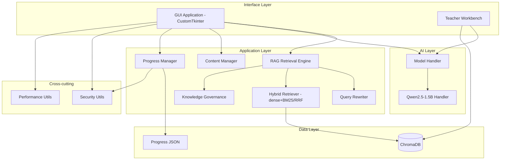

# Technical Implementation Guide

## System Architecture Overview

This document provides a detailed technical overview of the **Mati Learning System**'s architecture, elucidating the structure, function, and interaction of its core components. The architecture is designed to support an **offline-first, RAG-powered learning experience** with a single lightweight **Qwen2.5-1.5B-Instruct** model, optimized for **low-end hardware** (4GB RAM, CPU-only).

Mati is a **graphical application only** — the interaction surface is a CustomTkinter desktop GUI. There is no terminal/command-line mode.



*Figure 1: High-Level Architecture (mirrors the diagram in `README.md`)*

### 1. Universal Content Ingestion

This unified pipeline replaces the earlier separated processing scripts, handling textbooks, notes, and handwritten materials in a single pass.

#### 1.1 Ingestion Pipeline (`scripts/ingest_content.py`)

*   **Purpose:** To ingest, process, and index all types of educational content (textbooks, scanned PDFs, handwritten notes) into the RAG system.
*   **Inputs:** PDF, TXT, MD, JSONL files (text or image-based).
*   **Outputs:** Vector embeddings stored in ChromaDB and structured metadata.
*   **Key Processes:**
    *   **Extraction:** `PyMuPDF` for text-layer PDFs; each page is prefixed with a `[[PAGE:n]]` marker.
    *   **Glyph repair:** `system/rag/text_cleanup.py` fixes PDF font ToUnicode failures (italic math letters mapped to rare CJK characters).
    *   **Structure-aware chunking:** split on heading hierarchy into **child chunks (~384 chars, for recall)** and **parent chunks (~1000 chars, complete sub-sections, fed to the model)**. Not fixed-size chunking.
    *   **Cleaning:** `clean_chunk_text` removes page-number-only lines, repeated running heads, orphan figure numbers, copyright/ISBN blocks.
    *   **Deduplication:** sha256 exact dedup, then cosine semantic dedup (threshold **0.95**, parent/child compared separately).
    *   **Conflict detection:** numeric contradictions among chunks sharing a `concept_key`.
    *   **Embedding Generation:** `sentence-transformers` with **`BAAI/bge-small-zh-v1.5`** (512-dim, cosine space, Chinese-optimized).
    *   **Storage:** ChromaDB, one collection per subject+grade (`neb_{subject}_grade_{n}`).
*   **Technology/Implementation Notes:** `scripts/ingest_content.py` (`UniversalContentIngester`). Also invoked from the GUI Teacher Workbench.

**Page traceability:** `page` used to be empty for every chunk. The cause was not "PDF parsing cannot extract page numbers" — it was `"\n".join(page.get_text())`, which **discards page boundaries**. The fix: insert `[[PAGE:n]]` per page → `scan_page_markers()` removes markers while recording each page's start offset in the cleaned text → chunks carry **absolute offsets** → `page_for_offset()` maps back to a page number.

> **Index rebuild:** the embedding model changed from `all-MiniLM-L6-v2` (384-dim) to `BAAI/bge-small-zh-v1.5` (512-dim). Vector spaces are incompatible, so old indexes must be rebuilt with `python scripts/rebuild_index.py`.
> Run `python scripts/verify_index.py` afterwards — freshly rebuilt indexes may have incomplete HNSW segments that cause silent zero-recall until the client re-opens them.

> **OCR is currently unavailable.** `easyocr` is not in `requirements.txt` and the `tesseract` executable is not on `PATH` (`_ocr_status()` returns `available: False`). Only PDFs with a text layer can be ingested.

#### 1.2 Hybrid Model

*   **Purpose:** Serve retrieval to a single shared model handler so that ingestion-time and query-time embeddings stay in the same vector space.
*   **Key Processes:** `sentence-transformers` loads the embedding model once and both the ingestion script and the RAG engine use it.

#### 1.3 ChromaDB Vector Database

*   **Purpose:** To store and index all content embeddings for fast, semantic similarity search and retrieval.
*   **Inputs:** Text embeddings with associated metadata.
*   **Outputs:** Indexed vector database ready for intelligent content retrieval.
*   **Key Processes:**
    *   Vector storage and indexing.
    *   Metadata management.
    *   Similarity search.
    *   Collection organization by subject and grade.
*   **Technology/Implementation Notes:** ChromaDB provides persistent storage and efficient similarity search, located in `mati_data/chroma_db/`.

### 2. AI Model Architecture (Single Qwen2.5-1.5B-Instruct Model)

This segment covers the streamlined AI architecture using a single, lightweight Qwen2.5-1.5B-Instruct model for all AI tasks, replacing the previous multi-model approach.

#### 2.1 Qwen2.5 Model Handler

*   **Purpose:** To manage a single GGUF model that handles all AI tasks including Q&A, answer grading and content generation.
*   **Inputs:** Student questions, RAG-retrieved context, conversation history, and raw prompts.
*   **Outputs:** AI-generated answers with confidence scores; streamed token iterators.
*   **Key Processes:**
    *   Model loading and warm-up.
    *   ChatML prompt construction (`<|im_start|>…<|im_end|>`).
    *   Streaming token generation.
    *   Answer post-processing (`_clean_answer`: strips `Q:/A:` prefixes, truncates exercise markers, normalizes whitespace).
    *   Confidence scoring.
*   **Technology/Implementation Notes:** Implemented in `ai_model/model_utils/qwen_handler.py` (`QwenHandler`), uses `llama-cpp-python` for GGUF inference.

**Model parameters (as implemented):**

```python
{
    "n_ctx": 4096,          # context window; must match retrieval.yaml -> context_budget.n_ctx
    "n_batch": 96,
    "n_threads": 4,         # tuned for a 4-core i3
    "n_gpu_layers": 0,      # CPU only
    "max_tokens": 768,      # answer generation
    "temperature": 0.6,     # Qwen2.5 guidance is 0.7; lowered for a small CPU model
    "top_p": 0.9,
    "repeat_penalty": 1.1
}
```

> `n_ctx` is defined in **two places** that must stay in sync: `qwen_handler.py` (`Llama(...)`)
> and `mati_data/config/retrieval.yaml → context_budget.n_ctx`. The retrieval engine derives the
> evidence budget from `n_ctx`; a mismatch overflows the context.

**Inference note:** the `llama_context: n_ctx_per_seq (4096) < n_ctx_train (32768)` line printed at
startup is an **info-level message, not an error**. It means the model's full training-time capacity
is unused — it does not degrade quality and is not a "context too small" symptom.

#### 2.2 Model Manager

*   **Purpose:** To provide a unified interface for all AI operations and to coordinate with the RAG system.
*   **Inputs:** Student questions, context, history, raw prompts.
*   **Outputs:** Answers, streamed tokens, model metadata.
*   **Key Processes:**
    *   Model lifecycle management (`load_model`, `warm_up`, `cleanup`).
    *   Locating the first `*.gguf` file inside the model directory.
    *   Error handling with Chinese fallback messages.
*   **Technology/Implementation Notes:** Located in `ai_model/model_utils/model_handler.py`. Public API: `get_answer()`, `get_answer_stream()`, `generate_response()`, `get_model_info()`, `cleanup()`. Grading and content generation both go through `generate_response(prompt, max_tokens)`.

### 3. RAG Retrieval Engine

This component provides intelligent content discovery and retrieval, forming the core of the system's content understanding capabilities.

#### 3.1 RAG Retrieval Engine

*   **Purpose:** To intelligently search and retrieve the most relevant content for any student question using semantic similarity and vector search.
*   **Inputs:** Student questions, subject filter, stream/status callbacks, conversation history.
*   **Outputs:** Answer text, `sources`, `confidence`, `llm_used`, optional `diagram`.
*   **Key Processes:**
    *   Input normalization (`system/input_processing/`).
    *   Query rewriting: synonym expansion + rule-based sub-question splitting (`query_rewriter.py`).
    *   **Soft grade routing**: grade orders collections and weights reranking, it does **not** hard-filter
        (a hard filter made cross-grade content answer "not found in textbooks").
    *   **Hybrid recall**: dense vectors + BM25 (`jieba` tokenization) merged by **RRF (k=60)**.
    *   **7-feature interpretable reranking** (replacing the earlier linear weighting).
    *   **Parent-child expansion**: hit child chunks are swapped for their parent chunks before context assembly.
    *   Context assembly under a token budget derived from `n_ctx` (`context_budget.pack_evidence`).
    *   **Citation generation**: `build_citations()` produces the numbering *and* the source descriptions
        (`book_title · chapter · page`). The model only writes `[n]` and therefore cannot fabricate a source.
    *   Streaming generation through `ModelHandler`.
    *   Post-generation: grounding check + citation-range check. Out-of-range citations **lower confidence only — the answer is never rewritten**.
    *   Confidence scoring and semantic caching (`rag_cache.py`).
*   **Technology/Implementation Notes:** `system/rag/rag_retrieval_engine.py`. `status_callback` receives progress messages (GUI status line) and falls back to `stream_callback` when absent.

**Retrieval pipeline:**

```
query → normalize → rewrite (synonyms / sub-questions)
      → soft grade routing (collection family)
      → parallel recall: dense + BM25
      → RRF fusion (k=60) → 7-feature rerank
      → parent-child expansion → evidence budget trim (2000 tokens)
      → citation numbering → streaming generation
      → grounding + citation validation → confidence adjustment
```

#### 3.2 Supporting RAG Modules

`system/rag/` currently contains 14 modules:

| Module | Role |
|---|---|
| `hybrid_retriever.py` | Dense + BM25 recall, RRF fusion; graceful degradation when HNSW fails |
| `query_rewriter.py` | Synonym expansion and sub-question splitting |
| `knowledge_governance.py` | Cleaning, dedup, conflict detection, query filters, citations, creation-request refusal |
| `context_budget.py` | `pack_evidence`: token budget + value-ordered assembly |
| `curriculum_catalog.py` | Textbook catalog → subject/grade/discipline; collection naming |
| `retrieval_config.py` | Config loading and defaults |
| `text_cleanup.py` | PDF glyph mis-mapping repair + LaTeX downgrade |
| `text_utils.py` | CJK-aware token/length/confidence helpers |
| `rag_cache.py` | Semantic cache for repeated queries |
| `anti_confusion_engine.py` | Evidence de-duplication and grounding judgment |
| `user_edge_case_handler.py` | Short-circuits greetings, math and other edge inputs |
| `ascii_diagram_library.py` | Pre-authored diagrams keyed by concept text |

**Governance query filter (pushed down to the Chroma `where` clause):**

```python
where = {"$and": [
    {"doc_type":     {"$ne": "parent"}},          # parents are fetched on hit, not recalled
    {"content_type": {"$nin": ["toc", "cover"]}},
    {"status":       {"$ne": "archived"}},
]}
```

A Python-side `passes_metadata_filter()` runs again as a fallback, because Chroma's `$ne`/`$nin`
behaviour for documents **missing** the key must not be relied upon.

**Refusal policy:** the primary signal is `query_coverage` (CJK bigram coverage), **not** `final_score`
— `final_score` carries constant feature floors and BM25 is batch-normalised, so positives and
negatives are not separable by it. An additional orthogonal rule (`is_creation_request`) refuses
"write me an essay/poem" style requests, which coverage cannot catch because words like
"essay/800/字" are naturally frequent in Chinese textbooks.

### 4. Student Learning Application (GUI only)

The student-facing part of the system is a single graphical application. It shares its AI scoring logic with the teacher views.

#### 4.1 GUI Learning Application (RAG-Enhanced)

*   **Purpose:** The graphical interface through which students interact with Mati, enhanced with RAG-powered content discovery.
*   **Inputs:** Student questions (free text and multiple-choice/short answers), navigation clicks.
*   **Outputs:** Streamed RAG answers with confidence indicator, AI-graded question feedback, progress views.
*   **Key Processes:**
    *   Background model initialization with a splash loader (`startup_loader.py`).
    *   RAG-powered Q&A with token streaming, status line and confidence badge.
    *   AI answer grading via `ModelHandler.generate_response()`.
    *   Follow-up context (last 6 turns).
    *   Progress persistence via `student_app/progress/progress_manager.py`.
    *   Progress export/import/reset with JSON content validation.
*   **Technology/Implementation Notes:** Entry point is `student_app/gui_app/main_window.py` (`NEBeduApp`). Views live in `student_app/gui_app/views/`; shared selectors and the diagram viewer in `student_app/gui_app/components/`.

#### 4.2 Teacher Workbench

*   **Purpose:** Let teachers import textbooks and generate structured content without leaving the GUI.
*   **Inputs:** PDF/TXT/MD files, subject and grade dropdown selections.
*   **Outputs:** ChromaDB collections for ingestion; `scripts/data_collection/data/content/{subject}_grade_{grade}_auto.json` for generation.
*   **Key Processes:**
    *   Copying selected textbooks into `textbooks/` then ingesting them through `scripts/ingest_content.UniversalContentIngester`.
    *   Calling `tools/pdf_to_content.generate_from_pdf()` to produce chapters, concepts and short-answer questions with the local model.
    *   Live status log, and a content-manager reload callback so new content appears immediately.
*   **Technology/Implementation Notes:** `student_app/gui_app/views/teacher_view.py`.

### 5. Content and Progress Management

#### 5.1 Content Manager

*   **Purpose:** To manage structured educational content and provide fallback content when RAG doesn't find relevant information.
*   **Inputs:** JSON-based structured content files.
*   **Outputs:** Validated content for student learning and RAG fallbacks.
*   **Key Processes:**
    *   Content loading and JSON-schema validation.
    *   Browsable topic flattening (`list_browseable_topics`) and path-based concept lookup (`get_concepts_at_path`).
    *   Content updates with timestamped backups (`update_content`).
*   **Technology/Implementation Notes:** Located in `system/data_manager/content_manager.py`. Default content directory: `scripts/data_collection/data/content`.

#### 5.2 Progress Manager

*   **Purpose:** Persist per-student attempt/correct counters.
*   **Key Processes:** `load_progress`, `save_progress`, `update_progress`, `get_progress_path`.
*   **Technology/Implementation Notes:** `student_app/progress/progress_manager.py`. Files live in `student_app/progress/progress_<username>.json`. `get_progress_path` routes the filename through `security_utils.sanitize_filepath` so a crafted username cannot escape the progress directory.

#### 5.3 Security Utilities

*   **Purpose:** Shared validation/logging helpers used by the GUI.
*   **API and call sites:**

| Function | Purpose | Wired into |
|---|---|---|
| `validate_username` | `^[A-Za-z0-9_]{3,32}$` check | `views/welcome_view.py` (live + on submit) |
| `sanitize_filepath` | Path-traversal guard | `progress/progress_manager.py` |
| `validate_content_input` | Size/type sanity check (<100 KB) | `main_window._import_progress` |
| `log_security_event` | Security event logging | `welcome_view.py`, `main_window.py` |

*   **Technology/Implementation Notes:** `system/security/security_utils.py`.

#### 5.4 Performance Utilities

*   **Purpose:** Timing and resource instrumentation.
*   **API and call sites:**

| Function | Purpose | Wired into |
|---|---|---|
| `timeit` | Decorator logging function duration | `NEBeduApp._grade_answer_with_ai` |
| `log_resource_usage` | Logs RSS (MB) and CPU % | model-init completion, answer completion |

*   **Technology/Implementation Notes:** `system/performance/performance_utils.py`.

## Dependencies

### Core Dependencies

```
llama-cpp-python==0.3.16 # Qwen2.5-1.5B GGUF inference
chromadb==1.4.0          # Vector database
sentence-transformers==5.2.0  # Embedding generation (BAAI/bge-small-zh-v1.5)
torch==2.9.1             # Inference backend
customtkinter==5.2.2     # Modern GUI framework
PyMuPDF==1.26.7          # PDF processing
jieba==0.42.1            # Chinese tokenization (BM25 recall)
rank_bm25==0.2.2         # BM25 keyword retrieval
numpy==2.2.6             # Vector math (semantic dedup)
Pillow==12.1.0           # Image handling (GUI icons)
```

> `jieba` and `rank_bm25` are **optional at runtime**: if either is missing the system degrades to
> pure dense retrieval instead of crashing.

### OCR Dependencies (currently NOT functional)

```
pytesseract==0.3.13      # in requirements.txt, but the tesseract executable is not on PATH
easyocr                  # NOT in requirements.txt
```

**OCR is unavailable in the current environment** (`_ocr_status()` → `available: False`).
Only PDFs with a text layer can be ingested. See the warning in §1.1.

### Testing Dependencies

```
pytest==9.0.2            # Testing framework
pytest-cov==7.0.0        # Coverage reporting
```

> The full, pinned dependency list is `requirements.txt`.

## Directory Structure

```
Mati/
├── mati_data/
│   ├── models/
│   │   ├── qwen2_5/                  # Qwen2.5-1.5B-Instruct-*.gguf
│   │   └── clip/                     # CLIP metadata (torch hub cache, optional)
│   ├── chroma_db/                    # ChromaDB collections (11, ~13k vectors)
│   ├── config/                       # retrieval.yaml / textbook_catalog.yaml / synonyms.yaml
│   ├── Diagramsdb/                   # Pre-authored diagram library (YAML)
│   ├── ingest_gov_report.jsonl       # Governance audit log (every drop is recorded)
│   └── conflicts.jsonl               # Conflict report (created only when conflicts found)
│
├── scripts/
│   ├── ingest_content.py             # Universal ingestion (incl. governance pipeline)
│   ├── rebuild_index.py              # Rebuild index (auto-runs health check at the end)
│   ├── verify_index.py               # Index health check (HNSW self-healing retries)
│   ├── check_retrieval.py            # End-to-end retrieval self-check (~4 min)
│   ├── eval_rag.py                   # Staged evaluation + 4-way ablation on the 78-question set
│   ├── verify_citations.py           # Citation chain e2e check (loads the 1.5B model)
│   ├── run_pattern_mining.py
│   ├── rag_data_preparation/
│   │   ├── enhanced_chunker.py       # Structure-aware chunking (parent/child)
│   │   ├── embedding_generator.py    # Embedding generation
│   │   ├── README.md
│   │   ├── QUICK_START.md
│   │   └── NOTES_GUIDE.md
│   ├── data_collection/data/content/ # Structured content JSON
│   ├── release/
│   │   ├── bootstrap.py              # Nuitka entry point (launches the GUI)
│   │   └── build_nuitka.ps1          # Windows build script
│   └── validation/
│       └── validate_standards.py     # Non-interactive standards check (--input-file)
│
├── system/
│   ├── diagrams/                     # Modular diagram system
│   ├── input_processing/             # Normalization & pattern mining
│   ├── rag/                          # RAG engine + knowledge governance (14 modules)
│   │   ├── rag_retrieval_engine.py   # Main engine (query entry point)
│   │   ├── hybrid_retriever.py       # Dense + BM25 + RRF
│   │   ├── knowledge_governance.py   # Clean/dedup/conflict/filter/citation
│   │   ├── query_rewriter.py         # Synonyms + sub-question splitting
│   │   ├── context_budget.py         # pack_evidence (budget + value ordering)
│   │   ├── curriculum_catalog.py     # Catalog & collection routing
│   │   ├── retrieval_config.py       # Config loading & defaults
│   │   ├── text_cleanup.py           # PDF glyph repair + LaTeX downgrade
│   │   └── rag_cache.py              # Semantic cache
│   ├── data_manager/                 # Content manager
│   ├── performance/                  # Timing / resource instrumentation
│   ├── security/                     # Validation helpers
│   └── utils/                        # Resource path resolution
│
├── ai_model/
│   └── model_utils/
│       ├── qwen_handler.py           # Qwen2.5 handler
│       └── model_handler.py          # Model manager
│
├── student_app/
│   ├── gui_app/
│   │   ├── main_window.py            # Main GUI (entry point)
│   │   ├── startup_loader.py         # Splash / progress loader
│   │   ├── components/               # Grade/subject selectors, diagram viewer
│   │   └── views/                    # welcome, browse, ask, progress, teacher, …
│   └── progress/
│       └── progress_manager.py       # Progress tracking
│
├── textbooks/                        # Textbook PDFs (27 files)
├── notes/                            # Teacher notes (placeholder; not in default ingest scope)
├── tests/                            # Test suite
└── docs/                             # Documentation
```

> `system/` and `student_app/` are **PEP 420 implicit namespace packages** (no `__init__.py`).
> Running scripts from outside the project root raises `ModuleNotFoundError: No module named 'system'`
> — run from the repo root, or set `PYTHONPATH`.

## Implementation Details

### 1. Qwen2.5 Model Handler

```python
class QwenHandler:
    def __init__(self, model_path: str, require_citations: bool = True):
        self.model_path = model_path          # a DIRECTORY; the .gguf is located inside it
        self.llm = None
        self.require_citations = require_citations

    def load_model(self) -> None:
        # llama.cpp with n_ctx=4096, n_batch=96, n_threads=4, n_gpu_layers=0
        ...

    def get_answer(self, question: str, context: str = "", history=None) -> Tuple[str, float]:
        prompt = self._build_prompt(question, context, history)   # ChatML
        response = self.llm(prompt, max_tokens=768, temperature=0.6,
                            top_p=0.9, repeat_penalty=1.1)
        answer = self._clean_answer(response["choices"][0]["text"].strip())
        return answer, self._calculate_confidence(answer, question)
```

The system prompt (9 numbered rules) instructs the model to write `[n]` citation markers after key
claims and **not** to write its own "依据：" summary line — the retrieval layer appends the source
list. `require_citations=False` disables the instruction (used by evaluation paths that skip the LLM).

### 2. RAG Retrieval Engine

```python
class RAGRetrievalEngine:
    def __init__(self,
                 chroma_db_path: str = "mati_data/chroma_db",
                 model_path: str = "mati_data/models/qwen2_5",   # a DIRECTORY
                 llm_handler=None,
                 load_llm: bool = True,          # False skips the 1GB GGUF load (retrieval-only)
                 hybrid_enabled: Optional[bool] = None,   # override config, for A/B ablation
                 rewrite_enabled: Optional[bool] = None,
                 grade_mode: Optional[str] = None,        # "soft"/"hard"
                 chroma_client=None):            # reuse an existing client — do NOT create a
                                                 # second PersistentClient on the same path
        ...

    def query(self, query_text, subject, grade=None, discipline=None,
              n_results=None, stream_callback=None, status_callback=None,
              conversation=None, already_normalized=False,
              capture_stages=False) -> Dict:
        # normalize -> rewrite -> soft grade routing -> hybrid recall (dense+BM25, RRF)
        # -> rerank -> parent-child expansion -> budget-trim evidence
        # -> citation numbering -> stream tokens -> grounding + citation checks
        ...
```

### 3. Streaming Contract

Status messages and answer tokens are delivered through **separate** callbacks so that progress text never leaks into the answer box:

```python
def query(self, query_text, subject, grade=None, discipline=None,
          n_results=None, stream_callback=None, status_callback=None,
          conversation=None, already_normalized=False, capture_stages=False): ...
```

* `stream_callback(token)` — answer body tokens (rendered in the answer panel).
* `status_callback(message)` — progress messages (rendered in the status line).
* `capture_stages=True` — attach `stage_debug` (rewrite / routing / candidate pool / rerank /
  evidence / generation intermediates) for staged evaluation.

## Critical Implementation Notes

### 1. Model Optimization
- GGUF (Q4_K_M) format for CPU-friendly inference
- 4 threads pinned for 4-core i3 CPUs
- **4096-token** context window (sync with `retrieval.yaml → context_budget.n_ctx`)
- ChatML prompt format
- Robust Chinese-language fallbacks

### 2. RAG System
- ChromaDB for vector storage (cosine space)
- `BAAI/bge-small-zh-v1.5` (512-dim) embeddings
- Hybrid recall: dense + BM25 → RRF (k=60); subject/grade-aware collection routing (soft)
- Parent-child index: children for recall, parents for context
- Semantic caching; refusal below the calibrated query-coverage threshold (0.28)

### 3. Performance Optimization
- Background initialization with a splash loader
- Lazy content/model access
- Efficient vector search
- Resource instrumentation via `system/performance/`

### 4. Error Handling
- Graceful degradation when RAG fails
- Model error fallbacks
- Content validation on load
- Security event logging

## Testing Strategy

### 1. Unit Tests
`tests/test_content_manager.py`, `tests/test_diagram_system.py`, `tests/test_input_normalizer.py`, `tests/test_input_normalizer_unit.py`, `tests/test_adaptive_normalizer_unit.py`, `tests/test_pattern_miner_unit.py`, `tests/test_model_handler.py`

```python
def test_qwen_handler():
    # model_path is a DIRECTORY; the handler locates the .gguf inside it
    handler = QwenHandler("mati_data/models/qwen2_5")
    answer, confidence = handler.get_answer("什么是人工智能？",
                                           "人工智能是研究如何让计算机模拟人类智能的学科")
    assert isinstance(answer, str)
    assert len(answer) > 0
    assert 0.0 <= confidence <= 1.0
```

### 2. Integration Tests
- End-to-end RAG pipeline (`tests/test_complete_pipeline.py`)
- RAG engine behaviour (`tests/test_rag_retrieval_engine.py`)
- Normalizer → RAG → LLM flow
- P0 fixes (`tests/test_rag_p0_fixes.py` — 18 items), P1 hybrid retrieval (`tests/test_rag_p1_fixes.py`),
  P2 governance (`tests/test_rag_p2_governance.py` — 69 items incl. page traceability, citations,
  creation-refusal, dedup, conflict detection, metadata-completeness semantics)

**Regression baseline (2026-10-02):** the 7 RAG-related test files run **199 passed**.
Running the *full* suite (`pytest tests/`) yields **368 passed / 9 failed** — the 9 failures are
long-standing and unrelated to recent work (they assert a `status` key that the return body has
never had, and query `subject="Biology"`, which is not in the index). Do not mistake them for a
new regression.

### 3. Performance Tests
- Memory usage monitoring (`tests/test_benchmarks.py`)
- Cold vs. warm query latency
- Vector search performance
- Model loading time

> **Note:** there is currently **no GUI end-to-end test**. UI behaviour is verified manually.

## Security Measures

### 1. Content Security
- Username validation (`validate_username`)
- Path-traversal guard for progress files (`sanitize_filepath`)
- Import-time content validation (`validate_content_input`)
- Security event logging (`log_security_event`)

### 2. Data Protection
- Local data storage only
- No external API calls for inference
- Progress files stored per user under `student_app/progress/`

## Future Enhancements

### 1. Short-term
- Enhanced RAG capabilities
- Multi-language support
- Image understanding
- GUI end-to-end tests

### 2. Long-term
- Community content contributions
- Adaptive learning algorithms
- Multi-modal content support
- Advanced analytics

## Deployment Guide

### 1. Prerequisites
- Python 3.10+
- 4GB RAM minimum (8GB recommended for development)
- Sufficient disk space for models and content (~1 GB for the Qwen GGUF)
- `llama-cpp-python` support (a C++ toolchain helps)

### 2. Installation
```bash
# Create virtual environment
python -m venv venv
source venv/bin/activate  # or venv\Scripts\activate on Windows

# Install dependencies
pip install --upgrade pip
pip install -r requirements.txt

# OCR is currently NOT functional in this repo:
# easyocr is not in requirements.txt, and the tesseract executable is not on PATH.
# Only PDFs with a text layer can be ingested. To enable OCR you must install both.
```

### 3. Model Setup
Download the GGUF model into `mati_data/models/qwen2_5/`:

```bash
huggingface-cli download Qwen/Qwen2.5-1.5B-Instruct-GGUF \
    Qwen2.5-1.5B-Instruct-Q4_K_M.gguf \
    --local-dir mati_data/models/qwen2_5
```

The Chinese embedding model (`BAAI/bge-small-zh-v1.5`) is downloaded automatically
by `sentence-transformers` on first use.

### 4. Running
```bash
# Start the application (the only interface)
python -m student_app.gui_app.main_window

# Run tests
pytest tests/

# Build a standalone Windows executable
powershell -File scripts/release/build_nuitka.ps1
```

## Maintenance

### 1. Regular Tasks
- Content updates and RAG reindexing (`scripts/rebuild_index.py`)
- Model performance monitoring
- ChromaDB optimization
- Log review

### 2. Backup Strategy
- Content backups
- Model versioning
- ChromaDB backups

## Additional Resources

### 1. Documentation
- Qwen2.5 model documentation
- ChromaDB documentation
- RAG system guides

### 2. External Links
- [Qwen2.5-1.5B-Instruct-GGUF](https://huggingface.co/Qwen/Qwen2.5-1.5B-Instruct-GGUF)
- [BAAI/bge-small-zh-v1.5](https://huggingface.co/BAAI/bge-small-zh-v1.5)
- [ChromaDB documentation](https://docs.trychroma.com/)
- [llama-cpp-python](https://github.com/abetlen/llama-cpp-python)

## Known Limitations

### 1. Technical
- Memory usage grows with large content collections
- Vector search performance degrades with very large databases
- Model accuracy limitations on a 1.5B model (citation instruction-following is 0% — the model
  rarely writes `[n]`; numbering comes from the retrieval layer, so no fake sources can appear)
- No automated GUI end-to-end tests
- OCR is unavailable (see §1.1)

### 2. Content
- Scanned PDFs cannot be ingested (no OCR); only text-layer PDFs
- `notes/` teacher notes are not yet part of the default ingest scope
- The index covers grades **10–11** only; conflict detection is inert until chunks carry
  `concept_key` annotations (the field is reserved but unpopulated)

### 3. Data
- Aggregate/class-level reporting must be derived manually from the collected per-student progress JSON files (the former analytics CLI was removed)

### 4. ChromaDB Operational Traps (observed, worked around)
- **Never create a second `PersistentClient` on the same path within one process.** The second
  client intermittently fails certain collections with `Error finding id` (silent zero-recall).
  Pass the same client into `RAGRetrievalEngine(chroma_client=...)` instead.
- **Freshly rebuilt indexes may have incomplete HNSW segments.** The collection silently returns
  nothing until the client re-opens it (self-healing). Run `scripts/verify_index.py` before any
  evaluation; `rebuild_index.py` already runs it automatically and exits with code 3 on failure.
- Chroma metadata accepts **scalars only** (`str`/`int`/`float`/`bool`/`None`); passing a list
  raises `ValueError` and aborts ingestion. The GraphRAG-reserved `prerequisites` field is stored
  as a JSON string for this reason.

## Troubleshooting

### 1. Common Issues
- Model loading failures
- ChromaDB connection issues
- Memory errors
- Slow first answer
- A whole subject returns nothing (silent zero recall)

### 2. Solutions
- Verify a `.gguf` file exists in `mati_data/models/qwen2_5/` (pass the **directory**, not the file)
- Confirm `mati_data/chroma_db/` exists and re-run ingestion if empty
- Close other applications; expect long TTFT on the i3 target machine
- **Run `python scripts/verify_index.py` first** — incomplete HNSW segments self-heal on re-open
- Re-check logs in `mati.log` (note: `logging.basicConfig` contention means `security.log` /
  `performance.log` are never created; everything lands in `mati.log`)

## What's New in This Architecture

### P0 → P1 → P2 RAG Optimization (2026-10-02)
Three stages, each with a full implementation record in `docs/`:
- **P0 "stop the bleeding"** — chain-correctness fixes: chunk-ID collisions, broken CJK sentence
  boundaries, hard-capped `top_k=2`, double context truncation losing >45% of evidence,
  confidence stuck at 0.3 from `str.split()` on Chinese. Full re-index.
- **P1 "hybrid retrieval"** — BM25 + dense dual recall with RRF fusion (k=60), 7-feature
  interpretable rerank, query rewriting (synonyms + rule-based sub-questions), structure-aware
  parent/child chunking, soft grade routing (cross-grade recall 0% → 100%), evaluation
  infrastructure (78-question set, staged metrics, ablation).
- **P2 "knowledge governance & trustworthy generation"** — metadata schema completion with
  **page traceability**, governance filters pushed into the query `where` clause, rule cleaning +
  exact/semantic dedup, citation numbering generated by the retrieval layer with deterministic
  range validation, creation-request refusal, GraphRAG fields reserved (not implemented).

Resulting metrics (78-question eval, 2 repeats, 0 flips): Recall@10 **100%**, routing accuracy
**100%**, refuse-correct rate **91.7%**, false-refuse rate **12.1%**, metadata completeness
**95.3%**, governance leak **0**, citation out-of-range **0**.

### Major Changes from Previous Version
- **Single AI Model**: Replaced multiple models (DistilBERT, T5-small, Phi) with one efficient Qwen2.5-1.5B-Instruct
- **GUI-Only Interface**: The terminal interface and teacher CLI tools were removed; all interaction happens in the GUI
- **RAG System**: intelligent content discovery and retrieval using ChromaDB, upgraded to a hybrid
  recall + rerank + governance pipeline (see P1/P2 above)
- **Lightweight Design**: Optimized for low-end hardware
- **PDF-First Content**: Replaced web crawling with a PDF processing pipeline

### New Technical Features
- **Vector Database**: ChromaDB for semantic content search
- **Hybrid Recall**: dense + BM25 merged by RRF; graceful degradation when HNSW fails
- **Knowledge Governance**: cleaning, dedup, conflict detection, query filters, audit logging
- **Traceable Answers**: every evidence chunk carries `book_title · chapter · page`
- **Smart Text Normalization**: Handles uppercase, lowercase, and mixed case input
- **Robust Fallbacks**: multiple fallback levels ensure students always get help

### Technical Improvements
- **Offline-First**: 100% local operation, no internet required
- **Performance**: faster inference with optimized Qwen2.5 parameters; semantic cache now actually
  persists (a P0-era unreachable code path was fixed)
- **Reliability**: better error handling, grounding check, citation validation, confidence scoring
- **Scalability**: easy to add new subjects through the catalog config + rebuild

## See also
- [Project Overview](PROJECT_OVERVIEW.md)
- [Project Standards](PROJECT_STANDARDS.md)
