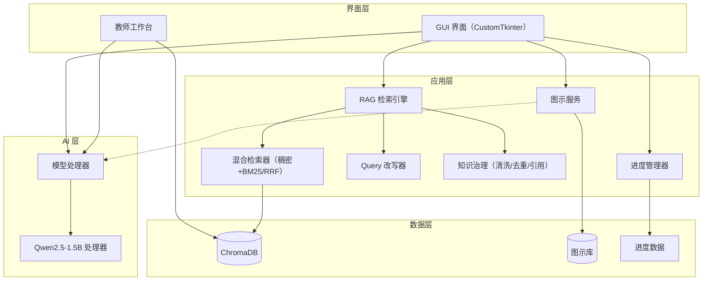

# Mati: 学习伴侣（Learning Companion）


一个**离线优先**的教育平台，将**检索增强生成（RAG）**与 **Qwen2.5-1.5B-Instruct 语言模型**相结合。设计用于在标准硬件（4GB 内存）上完全本地运行，不依赖网络。本项目已针对**中文**场景适配（生成、嵌入、OCR 均支持中文），并通过**图形界面（GUI）**提供全部交互能力。

---

## 目录

- [概述](#概述)
- [核心功能](#核心功能)
- [系统架构](#系统架构)
- [技术规格](#技术规格)
- [安装](#安装)
- [快速开始](#快速开始)
- [内容管理](#内容管理)
- [使用指南](#使用指南)
- [API 参考](#api-参考)
- [故障排查](#故障排查)
- [贡献](#贡献)
- [致谢](#致谢)
- [版本历史](#版本历史)

---


## 概述

Mati 是一个面向教育场景优化的**本地优先**学习平台。它使用 RAG 与 Qwen2.5-1.5B-Instruct 模型提供内容索引与问答能力，在**离线与在线环境下功能完全一致**，并已针对中文教学场景完成适配。系统专为资源受限的硬件设计，确保不依赖基础设施也能使用。

---

## 使命与愿景

### 我们的使命

**让 AI 驱动的教育惠及每一位学生——无论其地理位置、网络状况或硬件条件。**

Mati 致力于解决农村教育的基础设施限制，提供一套自包含的 AI 辅导系统。它消除了对高速网络或现代设备的需求，确保偏远地区的学生也能获得与联网环境相同的学习资源。

### 教育鸿沟（背景）

> [!IMPORTANT]
> 西藏中小学宽带入校、多媒体教室覆盖率 100%，但 2025 年全区中小学数字校园覆盖率仅**60%**；农牧偏远牧区部分学生家庭存在移动网络不稳、流量成本高、居家线上学习条件不足的数字鸿沟，边境教学点双师课堂常态化应用难度大，设备运维人力与长期经费保障薄弱

**农村学生面临的现实：**

- **连接鸿沟**：部分偏远点位网络延迟高达 800ms，课堂卡顿率超 70%，居家学习只能依靠手机移动网络，高峰时段信号不稳定
- **设备获取**：学校多媒体班班通 100%，但**家庭端学习终端不足**
- **硬件限制**：高海拔低温环境加速电子设备老化；阿里措勤县江让乡小学 2024 年有 23 台设备因电池老化损坏，设备闲置率最高达 60%
- **学校设施**：全区中小学宽带入校、多媒体教室覆盖率 100%，但**2025 中小学数字校园覆盖率仅 60%**，边境小规模教学点达标率偏低；
- **成本障碍**：信息化硬件采购多依靠一次性专项、援藏资金，**长期运维、设备迭代经费保障不足**

**结果：** 系统性将农村学生排斥在 AI 革命之外。现有教育科技产品都假设了农村教室中并不存在的基础设施。

### 我们的解决方案：离线优先的 AI 教育

Mati 通过以下方式打破这些障碍：

**1. 离线优先架构**

- 无网络也能完整使用
- 一次性下载，终身离线使用
- 无云端依赖、无订阅费用

**2. 低资源优化**

- 4GB 内存、仅 CPU 即可运行
- 兼容农村学校常见的十年旧硬件
- 针对第三代 Intel i3 处理器优化

**3. 智能 RAG 系统**

- 本地向量数据库（ChromaDB）用于内容检索
- 混合召回（稠密 + BM25）与页码级溯源，答案可指回教材原文
- 无需外部 API 即可获得上下文感知的回答

**4. 单一模型高效运行**

- Qwen2.5-1.5B-Instruct（GGUF Q4_K_M，约 1GB）承担所有 AI 任务
- 中文能力强，中英双语均衡
- 无需多模型或复杂流水线
- 针对有限资源优化快速推理

**5. 社区驱动内容**

- 教师贡献本地课程材料
- 支持 PDF、扫描文档、手写笔记
- 透明、协作式的内容工作流

### 影响与覆盖

**目标受益者：**

- **主要：** 25万+ 中学生（8–12 年级）
- **次要：** 农村地区公立学校
- **第三级：** 基础设施受限的远程学习中心

**可衡量的成果：**

- **可及性：** 无需网络即可 24/7 使用 AI 辅导
- **公平性：** 城乡学生获得同等质量的教育
- **可负担性：** 初始部署后零持续成本
- **可扩展性：** 一位教师可为数千名学生准备内容
- **可持续性：** 社区维护的开源平台

### 设计哲学

> [!NOTE]
> Mati 的每一项技术决策都遵循 **可及性优先于性能、简洁优先于功能、离线能力优先于云端便利**。

**核心原则：**

1. **离线优先** — 网络是可选而非必需
2. **资源友好** — 针对学生实际拥有的硬件优化
3. **赋能教师** — 教师掌控内容，而非企业
4. **以学生为中心** — 学习体验优先于技术复杂度
5. **社区驱动** — 透明、协作式开发

### 为何重要

**教育是一项基本权利，而非特权。** 每个学生都应享有 AI 辅助学习，而不仅仅是网络发达的城市学生。

Mati 证明：**智能、个性化教育并不需要昂贵的基础设施。** 通过精心的工程设计与社区协作，我们能为最需要的学生——那些被 AI 革命排除在外的人——提供 AI 辅导。

**这不只是技术问题，而是教育公平问题。**

---

## 核心功能

### 学生端功能

#### 内容检索（RAG）

- **混合召回** — 稠密向量 + BM25 关键词双路并行，用 RRF（k=60）融合
- **父子索引** — 子块（约 384 字符）负责精准召回，命中后回取其父块（约 1000 字符完整小节）喂给模型
- **结构感知切分** — 按标题层级切分，识别正文/定义/定理/例题/习题/目录/封面
- **年级软路由** — 年级只决定集合排序与重排加权，不做硬过滤，避免把跨年级内容误判为「教材中没有」
- **状态反馈** — 检索与生成过程的实时进度提示

> [!TIP]
> 目前索引覆盖 **27 本人教版/统编版教材**，共 11 个集合、13012 个向量（高一 10 / 高二 11 两个年级，4 个学科：数学、语文、科学、计算机）。

#### 溯源与可信生成

- **页码溯源** — 每个证据块都带 `book_title · chapter · page`，答案可指回具体教材的具体页
- **引用编号由系统生成** — 编号与来源描述均由检索层产出（`build_citations`），模型只负责写 `[n]`，因此不可能编造不存在的来源
- **引用越界校验** — 答案里的 `[n]` 超出实际证据范围时会被检出并降低置信度（不擅自改写答案）
- **明确拒答** — 教材中查不到时不让模型自由发挥，直接返回「未找到」；并对「写一篇作文」这类创作类请求单独拒答

#### 学习辅助

- **回答生成** — 基于证据的中文解释（单次最多 768 token）
- **Token 流式输出** — 低延迟逐字符显示
- **置信度指标** — 低于 70% 显示中等置信度，低于等于 40% 显示低置信度提示
- **输入归一化** — 自动纠正大小写、口语、错别字与考试套话

#### 图示解释

- **ASCII 图示** — 从文本生成结构图、流程图与关系图
- **年级感知图库** — 预置 8–12 年级适龄图示库
- **自然触发** — 智能判断何时显示图示最有帮助
- **模式识别** — 从 RAG 内容识别循环、层级与顺序步骤
- **零依赖** — 纯文本渲染，无需外部库

#### 用户界面

- **图形界面（GUI）** — 基于 CustomTkinter 的现代响应式界面，**本项目的唯一交互方式**
- **进度追踪** — 详细分析与可视化
- **导入/导出** — 保存与恢复学习进度（导入前会做 JSON 与内容大小校验）
- **教师工作台** — 图形化导入教材、从 PDF 生成章节与测试题，全程无需命令行


### 教师端功能

#### 内容管理

- **通用摄取** — 单个脚本处理 PDF、TXT、MD、JSONL
- **教材目录识别** — 按 `mati_data/config/textbook_catalog.yaml` 匹配书名，推断学科/年级/细分
- **PDF 字形修复** — 修复部分教材字体缺少正确 ToUnicode 映射导致的数学字母变生僻汉字问题
- **规则清洗** — 去除页码孤行、重复页眉、孤立图注编号、版权/ISBN 块
- **两级去重** — sha256 精确去重，再做余弦语义去重（阈值 0.95，父/子块分开比较）
- **结构感知切分** — 按标题层级切分并生成父子两级块，而非固定长度硬切
- **元数据补全** — 写入 `chapter` / `section` / `page` / `status` / `textbook_version` 等字段，全部删改落审计日志

> [!NOTE]
> 所有内容摄取请使用 `scripts/ingest_content.py`。它取代了之前的所有摄取脚本。

> [!WARNING]
> **扫描件 OCR 当前不可用**：`easyocr` 未列入依赖，`tesseract` 可执行文件也不在 `PATH` 上
> （`_ocr_status()` 实测返回 `available: False`）。只有带文字层的 PDF 能被摄取。
> 若确需 OCR，请自行安装 `easyocr` 或安装 Tesseract 并将 `chi_sim` 语言包与可执行文件加入 `PATH`。

---

## 系统架构

### 高层架构




**检索一次问答的完整链路：**

```
问题 → 输入归一化 → Query 改写（同义词扩展 / 子问题拆解）
     → 年级软路由（选集合族）
     → 双路召回：稠密向量 + BM25
     → RRF 融合（k=60）→ 7 特征重排
     → 父子展开（子块命中 → 取父块）
     → 证据预算裁剪（2000 token）
     → 生成引用编号 → 模型流式生成
     → 忠实度校验 + 引用越界校验 → 降置信度（不改答案）
```

### 组件架构

#### 1. 通用内容摄取

**实现：** `scripts/ingest_content.py`（`UniversalContentIngester`）

- **多格式支持** — PDF、TXT、MD、JSONL
- **OCR 模式** — `--ocr-mode auto|force|never`（**当前环境无可用 OCR 引擎**，见上文警告）
- **知识治理** — 清洗 → 精确去重 → 嵌入 → 语义去重 → 冲突检测，每步都落审计日志

**处理流程：**

```
输入文件（PDF/TXT/MD/JSONL）
    ↓
PDF 抽取（每页插入 [[PAGE:n]] 标记）
    ↓
字形修复 + 页标记扫描（记录各页起始偏移）
    ↓
结构感知切分（标题层级 → 父块 ~1000 字符 / 子块 ~384 字符）
    ↓
逐块规则清洗（页码孤行 / 页眉 / 图注编号 / 版权块）
    ↓
sha256 精确去重
    ↓
嵌入生成（BAAI/bge-small-zh-v1.5，512 维，cosine）
    ↓
余弦语义去重（阈值 0.95，父/子块分开比较）
    ↓
冲突检测（同 concept_key 的数值矛盾）
    ↓
ChromaDB 存储（元数据含 book_title/chapter/section/page/status）
```

页码能落到每个块上，靠的是抽取时插 `[[PAGE:n]]` 标记、切分时记录块的**全文绝对偏移**，再反查所属页——`page` 此前一直为空的原因不是「PDF 解析不出页码」，而是拼接时丢了页边界。

#### 2. RAG 检索引擎

**实现：** `system/rag/rag_retrieval_engine.py`（`RAGRetrievalEngine`）

- **Query 改写** — 术语同义词扩展 + 规则型子问题拆解（`system/rag/query_rewriter.py`）
- **混合召回** — 稠密向量 + BM25 双路并行后 RRF 融合（`system/rag/hybrid_retriever.py`）
- **特征重排** — 7 个可解释特征加权，替代早先的线性加权
- **证据预算** — 按 `n_ctx` 动态计算（见 `mati_data/config/retrieval.yaml → context_budget`）
- **知识治理过滤** — 查询层即排除父块、目录/封面块、已下架块
- **输出后校验** — 忠实度校验 + 引用越界校验

主要配套模块（`system/rag/`）：

| 模块 | 职责 |
|------|------|
| `hybrid_retriever.py` | 稠密 + BM25 双路召回与 RRF 融合；HNSW 失效时逐级降级 |
| `query_rewriter.py` | 同义词扩展与子问题拆解 |
| `knowledge_governance.py` | 清洗/去重/冲突检测/检索过滤/引用生成与校验/创作类拒答 |
| `context_budget.py` | `pack_evidence`：按 token 预算与价值排序组装证据 |
| `rag_cache.py` | 语义缓存（命中即返回，不重复检索） |
| `anti_confusion_engine.py` | 证据去冗余与忠实度判定 |
| `curriculum_catalog.py` | 教材目录 → 学科/年级/细分，集合名生成 |
| `retrieval_config.py` | 检索配置的读取与默认值 |
| `text_cleanup.py` | PDF 字形错映射修复与 LaTeX 降级 |

> [!NOTE]
> 检索层的全部可调参数集中在 `mati_data/config/retrieval.yaml`，
> 教材目录在 `mati_data/config/textbook_catalog.yaml`，同义词表在 `mati_data/config/synonyms.yaml`。
> 改参数请改配置，不要在代码里写死。

#### 3. AI 模型架构

**Qwen2.5-1.5B-Instruct 模型处理器：** `ai_model/model_utils/qwen_handler.py`（`QwenHandler`）

- **模型格式** — GGUF（Q4_K_M 量化）
- **提示词格式** — ChatML（`<|im_start|>`…`<|im_end|>`）
- **上下文窗口** — 4096 token（CPU 友好）
- **线程管理** — 固定 4 线程（针对四核/超线程 i3 优化）
- **流式输出** — 实时逐 token 生成
- **中文支持** — 系统提示与回答均为中文；公式一律用纯文本 Unicode 书写（界面是纯文本答案框，渲染不了 LaTeX）

**实际参数（见 `qwen_handler.py` 的 `Llama(...)` 与生成调用）：**

```python
{
    "n_ctx": 4096,             # 上下文窗口；与 retrieval.yaml 的 context_budget.n_ctx 必须一致
    "n_batch": 96,
    "n_threads": 4,            # 针对 4 核优化
    "n_gpu_layers": 0,         # 仅 CPU
    "max_tokens": 768,         # 单次回答上限
    "temperature": 0.6,        # Qwen2.5 官方建议 0.7，此处略降低
    "top_p": 0.9,              # 核采样
    "repeat_penalty": 1.1      # 重复控制
}
```

> [!IMPORTANT]
> `n_ctx` 在 `qwen_handler.py` 与 `mati_data/config/retrieval.yaml → context_budget.n_ctx`
> 两处都必须为 4096。检索引擎按 `n_ctx` 反推证据预算，两处不一致会导致上下文溢出。

#### 4. 图示生成引擎

**实现：** `system/diagrams/diagram_service.py`

- **模块化架构** — 职责分离：服务（逻辑）、图库（数据）、渲染器（视觉）
- **图库优先** — 先查找适龄的手工图示，再尝试生成
- **模式挖掘** — 基于正则从文本提取流程、循环与层级作为后备
- **上下文集成** — 使用 RAG 上下文丰富图示标签

**生成流程：**

```
回答文本
    ↓
检查图示库（年级/学科过滤）
    ↓
匹配？ ──是──→ 渲染预置图示
    ↓ 否
分析可视化潜力（should_show_diagram）
    ↓
模式识别 / AI 提取
    ↓
ASCII 渲染
```

---

## 技术规格

### 依赖

#### 核心依赖

版本以 `requirements.txt`（**UTF-16 LE + BOM 编码，修改时须保持该编码**）为准：

| 软件包                    | 版本    | 用途                                       |
| ------------------------- | ------- | ------------------------------------------ |
| `llama-cpp-python`      | 0.3.16  | Qwen2.5-1.5B 模型推理                      |
| `chromadb`              | 1.4.0   | RAG 向量数据库                             |
| `sentence-transformers` | 5.2.0   | 嵌入生成（BAAI/bge-small-zh-v1.5，512 维） |
| `torch`                 | 2.9.1   | 推理后端                                   |
| `customtkinter`         | 5.2.2   | 现代 GUI 框架                              |
| `PyMuPDF`               | 1.26.7  | PDF 处理                                   |
| `jieba`                 | 0.42.1  | 中文分词（BM25 召回）                      |
| `rank_bm25`             | 0.2.2   | BM25 关键词检索                            |
| `numpy`                 | 2.2.6   | 向量运算（语义去重）                       |

> `jieba` 与 `rank_bm25` 缺失时自动退化为**纯稠密检索**，不崩溃。

#### 可选 OCR 依赖（当前未启用）

| 软件包          | 版本    | 状态                                       |
| --------------- | ------- | ------------------------------------------ |
| `pytesseract` | 0.3.13  | 已在依赖中，但**可执行文件不在 PATH**，不可用 |
| `easyocr`     | —       | **未列入 `requirements.txt`**，不可用        |
| `Pillow`      | 12.1.0  | 图像处理（GUI 图标）                        |

> [!WARNING]
> 上表两项 OCR 依赖当前均不可用，因此**扫描版 PDF（无文字层）无法摄取**。
> 详见「核心功能 → 教师端功能」的 OCR 警告。

### 性能指标

检索层实测（78 题评测集，`scripts/eval_rag.py`，不含模型生成）：

| 指标         | 实测值   | 说明                                   |
| ------------ | -------- | -------------------------------------- |
| 单题检索耗时 | 0.4–1.2 s | 纯检索层，本机（非 i3 目标机）         |
| Recall@10    | 100.0%   | 78 题评测集                            |
| Recall@5     | 97.0%    | —                                      |
| MRR@10       | 0.831    | —                                      |
| 路由准确率   | 100.0%   | 学科 → 集合路由                        |
| 拒答正确率   | 91.7%    | 12 个库外问题                          |
| 误拒率       | 12.1%    | 66 个正样本被误判为「教材中没有」      |

> [!NOTE]
> 目标部署机型是第三代 i3 CPU + 4GB 内存，该机型上的端到端 TTFT 会显著长于上表的纯检索耗时
> （早先在该机型上测得冷启动约 14 秒）。**上表数字来自本机实测，不代表 i3 目标机表现**，
> 请勿混用。缓存命中时查询不重新检索，直接返回。

### 文件结构

```
Mati/
├── mati_data/
│   ├── models/                       # AI 模型
│   │   ├── qwen2_5/                  # 语言模型（Qwen2.5-1.5B GGUF）
│   │   └── clip/                     # CLIP 元数据（torch hub 缓存，可选）
│   ├── chroma_db/                    # 向量数据库
│   ├── Diagramsdb/                   # 预置图示（YAML）
│   └── normalization_logs/           # 输入归一化日志
│
├── scripts/
│   ├── ingest_content.py             # 通用摄取脚本（含知识治理）
│   ├── rebuild_index.py              # 重建索引（自动做健康校验）
│   ├── verify_index.py               # 索引健康校验（HNSW 自愈重试）
│   ├── check_retrieval.py            # 检索端到端自检（多学科抽样）
│   ├── eval_rag.py                   # 检索层分阶段评测与消融
│   ├── verify_citations.py           # 引用链路端到端验证（会加载 1.5B 模型）
│   ├── run_pattern_mining.py         # 模式挖掘工具
│   ├── validation/                   # 规范校验（validate_standards.py --input-file）
│   ├── rag_data_preparation/         # 数据流水线工具
│   ├── data_collection/              # 数据集采集工具（含 data/content）
│   └── release/                      # 打包发布（bootstrap.py、build_nuitka.ps1）
│
├── system/
│   ├── diagrams/                     # 模块化图示系统
│   │   ├── diagram_service.py        # 编排逻辑
│   │   ├── diagram_library.py        # YAML 图库管理器
│   │   ├── diagram_renderer.py       # ASCII/Mermaid 渲染
│   │   └── diagram_config.py         # 可视化配置
│   ├── input_processing/             # 文本归一化与清理
│   ├── rag/                          # RAG 检索引擎与知识治理（14 个模块）
│   │   ├── rag_retrieval_engine.py   # 主引擎（query 入口）
│   │   ├── hybrid_retriever.py       # 稠密 + BM25 + RRF 融合
│   │   ├── knowledge_governance.py   # 清洗/去重/冲突/过滤/引用
│   │   ├── query_rewriter.py         # 同义词 + 子问题拆解
│   │   ├── context_budget.py         # 证据预算与价值排序
│   │   ├── curriculum_catalog.py     # 教材目录与集合路由
│   │   ├── retrieval_config.py       # 配置读取与默认值
│   │   ├── text_cleanup.py           # PDF 字形修复 + LaTeX 降级
│   │   └── rag_cache.py              # 语义缓存
│   ├── data_manager/                 # 数据处理逻辑
│   ├── performance/                  # 性能埋点（timeit / log_resource_usage）
│   ├── security/                     # 输入校验与安全事件日志
│   └── utils/                        # 共享工具（资源路径解析）
│
├── ai_model/
│   └── model_utils/                  # 模型推理处理器
│
├── student_app/
│   ├── gui_app/                      # CustomTkinter GUI（唯一交互方式）
│   │   ├── main_window.py            # GUI 应用入口（NEBeduApp）
│   │   ├── startup_loader.py         # 启动加载进度窗
│   │   ├── components/               # 年级/学科选择器、图示查看器
│   │   └── views/                    # 欢迎、浏览、提问、进度、教师工作台等页面
│   └── progress/                     # 进度追踪逻辑（progress_manager）
│
├── tests/                            # 单元与集成测试
├── docs/                             # 文档与指南
├── textbooks/                        # 输入源：教材
├── notes/                            # 输入源：教师笔记
├── tools/                            # 资源打包与低带宽同步工具链
├── requirements.txt
├── readme.md
└── LICENSE
```

---

## 安装

### 前置要求

- **Python** — 3.10 或更高
- **Git** — 版本控制系统
- **C++ 编译器** — 可选（用于 llama.cpp 优化构建）
- **硬件** — 最低 4GB 内存（开发建议 8GB）

### 逐步安装

#### 1. 克隆仓库

```bash
git clone https://github.com/aa-sikkkk/mati.git
cd Mati
```

#### 2. 创建虚拟环境

**Linux/macOS：**

```bash
python3 -m venv venv
source venv/bin/activate
```

**Windows：**

```cmd
python -m venv venv
venv\Scripts\activate
```

#### 3. 安装依赖

```bash
pip install --upgrade pip
pip install -r requirements.txt
```

> [!TIP]
> 如需 OCR 支持，安装可选依赖：
>
> ```bash
> pip install pytesseract pillow easyocr
> ```

#### 4. 下载 Qwen2.5 生成模型

下载 Qwen2.5-1.5B-Instruct GGUF 模型（Q4_K_M 量化）：

```bash
# 创建模型目录
mkdir -p mati_data/models/qwen2_5

# 用 Hugging Face CLI 下载官方 GGUF（Q4_K_M 量化，约 1GB）
huggingface-cli download Qwen/Qwen2.5-1.5B-Instruct-GGUF \
    Qwen2.5-1.5B-Instruct-Q4_K_M.gguf \
    --local-dir mati_data/models/qwen2_5
```

**模型来源：**

- Hugging Face: [Qwen/Qwen2.5-1.5B-Instruct-GGUF](https://huggingface.co/Qwen/Qwen2.5-1.5B-Instruct-GGUF)
- 使用 GGUF 量化版本（Q4_K_M）

> [!IMPORTANT]
> 将模型文件放到 `mati_data/models/qwen2_5/` 目录，并确保扩展名为 `.gguf`。

#### 5. 下载中文嵌入模型

RAG 检索使用中文优化的嵌入模型 **BAAI/bge-small-zh-v1.5**（512 维，约 95MB），首次运行时由 `sentence-transformers` 自动下载，也可手动放置：

```bash
huggingface-cli download BAAI/bge-small-zh-v1.5 --local-dir mati_data/models/embedding
```

#### 6. 验证安装

```bash
python -m py_compile ai_model/model_utils/qwen_handler.py
python -m py_compile system/rag/rag_retrieval_engine.py
```

---

## 快速开始

### 启动 GUI（唯一入口）

```bash
python -m student_app.gui_app.main_window
```

也可以直接双击打包好的 `MatiGUI.exe`（见 `scripts/release/build_nuitka.ps1`）。

> [!NOTE]
> 首次运行需要 15–30 秒加载模型，后续运行更快。所有交互均在图形界面内完成，无需使用终端。

---

## 内容管理

### 添加教育内容

> [!IMPORTANT]
> 所有内容类型请使用通用摄取脚本。它取代了之前的所有摄取脚本。

#### 快速开始

**处理所有内容（默认）：**

```bash
python scripts/ingest_content.py
```

**处理指定文件夹：**

```bash
python scripts/ingest_content.py --input textbooks scripts/data_collection/data/content
```

> [!NOTE]
> 教师笔记目录 `notes/` 当前只有说明文件，**不列入默认摄取范围**
> （`rebuild_index.py` 默认只扫 `textbooks` 与 `scripts/data_collection/data/content`）。
> 待笔记就位后可用 `--content` 显式指定。

#### OCR 模式

**自动检测（推荐）：**

```bash
python scripts/ingest_content.py --ocr-mode auto
```

**强制对所有 PDF 使用 OCR：**

```bash
python scripts/ingest_content.py --ocr-mode force
```

**从不使用 OCR（仅文本）：**

```bash
python scripts/ingest_content.py --ocr-mode never
```

### 内容组织

**教材：**

```
textbooks/grade_10/
├── computer_science.pdf
├── english.pdf
└── science.pdf
```

**笔记：**

```
notes/grade_10/
├── cs_notes.pdf
├── english_summary.md
└── science_revision.txt
```

> [!TIP]
> 系统会自动从文件夹结构检测年级、从文件名检测学科。

### 验证

```python
import chromadb

client = chromadb.PersistentClient(path='mati_data/chroma_db')
collections = client.list_collections()

for c in collections:
    print(f"{c.name}: {c.count()} chunks")
```

### 重建索引（更换嵌入模型后必做）

嵌入模型已从 `all-MiniLM-L6-v2`（384 维）更换为 `BAAI/bge-small-zh-v1.5`（512 维）。
向量空间不同，**旧索引必须重建**，否则检索结果错乱。

```bash
# 自动备份旧索引并重新摄取（默认：textbooks + 内置 content）
python scripts/rebuild_index.py

# 指定内容目录
python scripts/rebuild_index.py --content textbooks scripts/data_collection/data/content

# 不备份直接删除旧索引
python scripts/rebuild_index.py --no-backup
```

> [!IMPORTANT]
> 重建需要 `chromadb` 与 `sentence-transformers`，首次会下载 bge 嵌入模型（~95MB）。
> 重建脚本**末尾会自动做一次索引健康校验**，未通过则返回码 3。

> [!WARNING]
> 重建完成后**不要立刻跑评测**。刚重建的索引个别集合的 HNSW 段可能尚未完整落盘，
> 会让该集合静默零召回。先跑一次 `python scripts/verify_index.py` 触发自愈。

### 教师指南：从课本 PDF 自动生成学科内容

如果教师手上只有课本 PDF，可以用系统内置的**教师工作台（图形界面）**一键完成，**全程无需使用命令行**：

**方式一：图形界面（推荐）**

1. 启动 GUI：`python -m student_app.gui_app.main_window`
2. 在侧边栏点击 **🧑‍🏫 教师工作台**
3. **导入教材到知识库**：点击"选择教材文件"选 PDF/TXT/MD → 点"导入知识库"，学生即可对课本提问
4. **生成章节与测试题**：点击"选择 PDF"选课本 → 选学科/年级 → 点"生成测试题"，AI 自动生成章节、概念与简答题；生成后到"浏览学科"即可查看与做题
5. 运行状态实时显示在界面下方

**方式二：批处理脚本（可选）**
教师工作台内部调用的就是 `tools/pdf_to_content.py`。如果需要在无人值守的批量场景（如一次性处理几十本教材）下运行，可以直接执行这个**非交互式**批处理脚本（见下方参数说明）。

**前提**：已下载 Qwen 模型（`mati_data/models/qwen2_5/*.gguf`）。

**基本用法（推荐显式指定学科与年级）：**

```bash
python tools/pdf_to_content.py --pdf 课本.pdf --subject 科学 --grade 10
```

默认输出到 `scripts/data_collection/data/content/`（系统启动自动加载）。之后启动 GUI 即可看到该学科的章节与题目。

**其他常用参数：**

```bash
# 指定输出目录（如同步工具下载的内容目录）
python tools/pdf_to_content.py --pdf 课本.pdf --subject 科学 --grade 10 --out mati_data/content

# 只处理前 2 页预览分章（不写文件）
python tools/pdf_to_content.py --pdf 课本.pdf --sample 2 --no-write

# 无模型自检（仅验证 PDF 提取与分章，不调用 Qwen）
python tools/pdf_to_content.py --pdf 课本.pdf --mock
```

> [!TIP]
> - `--subject` 支持中文或英文（科学/Science、数学/Math、英语语法/English Grammar、计算机科学/Computer Science 等）；`--grade` 为 8-12。
> - 若文件名含 `grade_10` 或"年级"，可自动推断，省略 `--grade`。
> - 生成内容是简答题（含参考答案与提示）；每章默认约 8 页，可用 `--pages-per-topic` 调整。
> - 扫描版 PDF（无文字层）无法直接提取，需先用 OCR（如 EasyOCR）转成文本 PDF。
> - 生成文件命名为 `{subject}_grade_{grade}_auto.json`；若该学科已有内容文件，可能覆盖其在应用中的显示，请注意备份。

### 文档

**RAG 优化（本轮主线）：**

- **方案总纲：** `docs/RAG优化方案.md`
- **P0 止血：** `docs/RAG优化-P0实施记录.md`
- **P1 混合检索：** `docs/RAG优化-P1实施记录.md`
- **P2 知识治理与可信生成：** `docs/RAG优化-P2实施记录.md`

**架构与工程：**

- **项目概览：** `docs/PROJECT_OVERVIEW.md`
- **技术架构：** `docs/TECHNICAL_IMPLEMENTATION.md`
- **工程规范：** `docs/PROJECT_STANDARDS.md`
- **GUI 关闭时序与模型上下文：** `docs/GUI关闭时序与模型上下文说明.md`
- **人工教材导入适配：** `docs/人工教材导入适配说明.md`、`docs/人工教材导入适配-P0P2修复记录.md`
- **公式乱码修复：** `docs/公式乱码修复与生成链路核查.md`

**其他：**

- **详细指南：** `scripts/rag_data_preparation/README.md`
- **快速开始：** `scripts/rag_data_preparation/QUICK_START.md`
- **策略指南：** `scripts/rag_data_preparation/NOTES_GUIDE.md`
- **教材 README：** `textbooks/README.md`

---

## 检测与验证

> [!NOTE]
> **GUI 内没有「检测」入口。** 侧边栏只有浏览学科 / 提问 / 教师工作台 / 学习进度 /
> 进度管理 / 关于 / 使用指南 七个导航项，教师工作台也只有导入与生成两个功能。
> 所有自检都通过下列命令行脚本执行。

| 脚本 | 检测范围 | 输出 | 耗时 |
|------|---------|------|------|
| `scripts/verify_index.py` | 11 个集合的 HNSW 段是否可用（多轮重开客户端触发自愈） | stdout | 秒级 |
| `scripts/check_retrieval.py` | 6 学科抽样端到端检索 + 库外拒答 + 缓存统计 | stdout | 约 4 分钟 |
| `scripts/eval_rag.py` | 78 题评测集，含四组消融（`--ablation`） | stdout，`--json` 落明细 | 约 2–3 分钟 |
| `scripts/verify_citations.py` | 引用链路端到端验证（**会加载 1.5B 模型**） | stdout | 约 2 分钟 |
| `pytest tests/` | 全量 377 项 | stdout | 约 7 分钟 |

```bash
PY=C:/Users/duanhongshangli/Anaconda3/envs/autoresearch/python.exe   # 项目实际环境

$PY scripts/verify_index.py          # 跑任何评测前先执行，触发 HNSW 自愈
$PY scripts/check_retrieval.py
$PY scripts/eval_rag.py --ablation
$PY scripts/verify_citations.py
```

**回归测试建议用定向文件**（P0/P1/P2 相关 7 个文件共 **199 项，全部通过**）：

```bash
$PY -m pytest tests/test_rag_p2_governance.py tests/test_rag_p1_fixes.py \
    tests/test_rag_p0_fixes.py tests/test_text_cleanup.py \
    tests/test_curriculum_catalog.py tests/test_collection_routing.py \
    tests/test_rag_retrieval_engine.py -q
```

> [!WARNING]
> 直接跑 `pytest tests/` 会得到 **368 passed / 9 failed**。这 9 项是**长期既有的**失败，
> 根因已定位：其中 5 项断言 `result["status"]`，而返回体只有 `type`；
> 且这些用例用 `subject="Biology"`，库中并无该学科（现有 chinese / computer_science /
> math / science）。另有 2 项属词表与缓存统计口径问题。**不要把它们误判为新引入的回归。**

### 摄取审计产物

| 文件 | 内容 |
|------|------|
| `mati_data/ingest_gov_report.jsonl` | 清洗/去重/冲突扫描的逐条事件（含丢弃原因，可回溯） |
| `mati_data/conflicts.jsonl` | 知识冲突报告（**仅在检出冲突时才创建**） |
| `mati_data/retrieval_failures.jsonl` | 真实检索失败语料，供模式挖掘反哺同义词表（评测流量不写入） |

> 「文件不存在」不等于「没跑」：冲突扫描事实也会记入治理报告
> （`stage:"conflict", action:"scan"`）。当前全库 `concept_key` 为空，故冲突产出为 0 条。

---

## 使用指南

### 学生界面

#### 提问

系统支持学科相关问题：

- "什么是计算机网络？"
- "解释二进制数字系统"
- "计算机网络的组成要素是什么？"

**回答生成过程：**

1. **正在搜索知识库...** — 初始反馈
2. **正在分析你的问题...** — 生成嵌入
3. **正在寻找最佳匹配...** — ChromaDB 检索
4. **正在生成回答...** — 开始模型推理
5. **Token 流式输出** — 实时回答显示

> [!TIP]
> 渐进式状态提示展示当前进度。检索层实测约 0.4–1.2 秒；端到端耗时以模型生成部分为主，目标机型（i3 CPU）上 TTFT 偏长属正常现象。

#### 置信度显示

系统仅在需要时显示置信度警告：

- **置信度 ≥ 70%** — 无提示（界面干净）
- **40–70%** — 警告：置信度中等
- **< 40%** — 警告：置信度低，请核实

---

## API 参考

### 模型处理器

#### `ModelHandler`

**位置：** `ai_model/model_utils/model_handler.py`

**位置：** `ai_model/model_utils/model_handler.py`

- `ModelHandler.get_answer(question, context="", answer_length="medium", history=None) -> (str, float)`
- `ModelHandler.get_answer_stream(question, context="", answer_length="medium", history=None) -> Iterator[str]`

```python
from ai_model.model_utils.model_handler import ModelHandler

handler = ModelHandler("mati_data/models/qwen2_5")   # 传**目录**，不是文件路径
answer, confidence = handler.get_answer(
    "什么是计算机网络？",
    "计算机网络是指将多台设备连接起来…",
    "medium"
)
```

> 构造参数传的是**模型目录**（内部自行查找目录下的 `.gguf`）；
> 传文件路径会报 `No .gguf file found in <文件名>`。

### RAG 检索引擎

#### `RAGRetrievalEngine`

**位置：** `system/rag/rag_retrieval_engine.py`

```python
from system.rag.rag_retrieval_engine import RAGRetrievalEngine

rag = RAGRetrievalEngine(load_llm=False)   # load_llm=False 时不加载 1GB 生成模型
result = rag.query(
    query_text="函数的奇偶性怎么判断？",
    subject="math",        # 也接受中文名或 GUI 键，内部做别名归一化
    grade="10",            # 年级编码 "10"/"11"/"12"；只做软加权，不做硬过滤
    discipline="mathematics",   # 可选，细分学科
    n_results=None,        # None 时取配置 candidate_k_per_collection
    stream_callback=None,  # 接收答案 token
    status_callback=None,  # 接收进度消息（与答案分离，避免流入答案框）
    conversation=None,     # 多轮历史 [(问题, 回答), ...]
    already_normalized=False,
    capture_stages=False,  # True 时返回 stage_debug，供分阶段评测
)

print(result["answer"], result["confidence"])
```

**返回体字段：**

| 字段 | 说明 |
|------|------|
| `answer` | 答案正文（流式回调同时推送） |
| `type` | `rag_response` / `no_evidence` / `creation_refused` |
| `confidence` | 0–1 置信度 |
| `sources` | 证据块元数据列表 |
| `citations` | 检索层生成的引用编号表 `[{index, book_title, chapter, page, label}, …]` |
| `citation_check` | 引用校验结果 `n_cited` / `n_valid` / `n_out_of_range` / `accuracy` |
| `llm_used` | 是否真的走了生成模型 |
| `context_used` | 实际喂给模型的证据文本 |
| `best_evidence_score` / `best_query_coverage` | 证据分与查询覆盖率 |
| `collections_used` / `context_stats` | 用过的集合、预算统计 |
| `stage_debug` | 仅 `capture_stages=True` 时返回，含六个阶段中间产物 |

> [!NOTE]
> 返回体**没有** `status` 字段，请判断 `type`。

---

## 故障排查

### 常见问题

#### 模型加载失败

> [!WARNING]
> 请确保 `mati_data/models/qwen2_5/` 中存在 `.gguf` 扩展名的模型文件。

**解决方案：**

1. 确认模型文件存在
2. 检查文件权限
3. 确保有足够的磁盘空间

#### 回答生成缓慢

> [!NOTE]
> 纯 CPU 下高质量 RAG 的 TTFT 偏长属正常现象（目标机型 i3 上冷启动约 14 秒）。

**优化建议：**

1. 关闭其他应用程序
2. 确认模型量化版本（Q4_K_M）
3. 检查系统内存占用
4. 重复提问会命中语义缓存，不再重新检索

#### RAG 检索无结果 / 某学科整体查不到

**按顺序排查：**

1. 确认索引健康：`python scripts/verify_index.py`
   —— HNSW 段未完整落盘会造成**整个集合静默零召回**，且会在重新打开客户端后自愈
2. 确认集合非空：`neb_{subject}_grade_{n}`，共 11 个集合 / 13012 个向量
3. 检查学科与年级：现有学科只有 chinese / computer_science / math / science，年级只有 10 / 11
4. 检查内容文件与摄取日志中的「跳过/失败」原因

> [!IMPORTANT]
> 同一进程内**不要对同一路径创建第二个 `PersistentClient`**。
> 实测会导致第二个客户端的某些集合间歇性查询失败（`Error finding id`），
> 表现为静默零召回。需要同时扫描元数据与检索时，把同一个 client 传进
> `RAGRetrievalEngine(chroma_client=...)`。

#### 扫描版 PDF 导入后无内容

PDF 若无文字层会走 OCR 分支，而当前环境**无可用 OCR 引擎**
（见「核心功能」的 OCR 警告），结果是空文本。请改用带文字层的 PDF。

#### GUI 生成时卡顿

> [!NOTE]
> 这是正常现象——模型推理在后台线程运行。请等待完成。

---

## 贡献

### 开发设置

1. Fork 本仓库
2. 创建功能分支：`git checkout -b feature/your-feature`
3. 遵循编码规范
4. 为新功能编写测试
5. 提交 Pull Request

### 内容贡献

参见文档：

- `scripts/rag_data_preparation/README.md`
- `scripts/rag_data_preparation/NOTES_GUIDE.md`

---

## 致谢

### 核心技术

- **Qwen2.5-1.5B-Instruct** — 轻量中文友好语言模型（[Apache 2.0](https://huggingface.co/Qwen/Qwen2.5-1.5B-Instruct)）
- **BAAI/bge-small-zh-v1.5** — 中文优化嵌入模型（[MIT License](https://huggingface.co/BAAI/bge-small-zh-v1.5)）
- **ChromaDB** — RAG 向量数据库（[Apache 2.0](https://github.com/chroma-core/chroma)）
- **llama-cpp-python** — 高效的 GGUF 推理（[MIT License](https://github.com/abetlen/llama-cpp-python)）
- **CustomTkinter** — 现代 GUI 框架（[MIT License](https://github.com/TomSchimansky/CustomTkinter)）
- **sentence-transformers** — 嵌入生成（[Apache 2.0](https://github.com/UKPLab/sentence-transformers)）

### 知识库数据集

Mati 的知识库基于以下开源教育数据集构建：

#### 科学与数学

- **[OpenStax Science](https://openstax.org/)**

  - 开源大学教材（生物、物理、化学）
  - 许可证：[CC BY 4.0](https://creativecommons.org/licenses/by/4.0/)
  - 用途：各年级通用科学概念
- **[ScienceQA](https://scienceqa.github.io/)**

  - 多模态科学问答数据集
  - 许可证：[CC BY-NC-SA 4.0](https://creativecommons.org/licenses/by-nc-sa/4.0/)
  - 用途：科学问题求解与解释
- **[FineMath](https://huggingface.co/datasets/HuggingFaceTB/finemath)**

  - 高质量数学推理数据集
  - 许可证：[ODC-By](https://opendatacommons.org/licenses/by/1-0/)
  - 用途：数学概念与问题求解
- **[GSM8K](https://github.com/openai/grade-school-math)**

  - 小学数学应用题
  - 许可证：[MIT License](https://opensource.org/licenses/MIT)
  - 用途：分步数学问题求解

#### 计算机科学

- **CS Stanford**（`cs_stanford` 集合）
  - 来源：[HuggingFaceTB/cosmopedia](https://huggingface.co/datasets/HuggingFaceTB/cosmopedia)（Stanford 种子数据）
  - 计算机科学和 STEM 的合成教材内容
  - 许可证：[Apache 2.0](https://www.apache.org/licenses/LICENSE-2.0)
  - 用途：编程概念与 CS 基础

#### 语言与通识教育

- **FineWeb-Edu**（`fineweb_edu` 集合）

  - 来源：[HuggingFaceFW/fineweb-edu](https://huggingface.co/datasets/HuggingFaceFW/fineweb-edu)
  - 高质量教育网页内容
  - 许可证：[ODC-By](https://opendatacommons.org/licenses/by/1-0/)
  - 用途：英语语言与通识知识
- **Khan Academy Pedagogy**（`khanacademy_pedagogy` 集合）

  - 来源：[HuggingFaceTB/cosmopedia](https://huggingface.co/datasets/HuggingFaceTB/cosmopedia)（Khan Academy 种子数据）
  - 叙述式教学风格的合成教育内容
  - 许可证：[Apache 2.0](https://www.apache.org/licenses/LICENSE-2.0)
  - 用途：跨学科的概念解释

> [!NOTE]
> 所有数据集均按其各自许可证使用。我们感谢这些宝贵教育资源的创作者与维护者。


### 社区

特别感谢：

- 贡献课程材料的**教师**
- 提供反馈与测试的**学生**
- 改进代码库的**开源贡献者**
- 让教育 AI 成为可能的**数据集创作者**

---

## 版本历史

### 当前版本：2.6（2026 年 10 月）

**RAG 三阶段优化（P0 → P1 → P2）**

三份实施记录是这一段的主要依据，均可在 `docs/` 查阅：
`RAG优化-P0实施记录.md`、`RAG优化-P1实施记录.md`、`RAG优化-P2实施记录.md`，
总纲见 `docs/RAG优化方案.md`。

#### P2 知识治理与可信生成（2026-10-02）

- **元数据 Schema 补全** — 补 `chapter` / `section` / `page` / `status` / `textbook_version`
- **打通页码溯源** — PDF 插页标记 → 偏移反查 → `page` 落库，答案可指回具体教材页码
- **查询层治理过滤** — 目录/封面/已下架块在召回阶段即被排除（此前只降权不阻止）
- **内容清洗与去重** — 规则清洗 + sha256 精确去重 + 余弦语义去重（阈值 0.95），删改全落审计
- **引用由检索层生成** — 编号与来源描述不由模型编造；越界校验只降置信度、不改答案
- **创作类请求拒答** — 与覆盖率正交的新判据
- **GraphRAG 预留** — 按方案**不实施**，仅预留 `concept_key` / `prerequisites` 字段
- 修复 8 个 bug，其中语义去重的矩阵索引错误会把索引悄悄削掉近一半正文

#### P1 混合检索 + 融合重排（2026-10-02）

- **BM25 双路召回 + RRF 融合**（k=60），引入 `jieba` + `rank_bm25`
- **7 特征可解释重排** 替代线性加权
- **Query 改写** — 术语同义词表 + 规则型子问题拆解 + 失败回流
- **结构感知切分 + 父子索引** — 子块召回、父块喂模型
- **年级软路由** — 跨年级内容 Recall 从 0% 提升到 100%
- **评测基础设施** — 78 题评测集 + 分阶段评测脚本 + 四组消融

#### P0 止血（2026-10-02）

- 修复 Chunk ID 冲突（同一集合内第二个文件覆盖第一个）、中文句子边界正则失效、
  top-k 被硬压到 2、二次上下文截断丢弃 >45% 证据、置信度因中文 `split()` 恒为 0.3 等问题
- 全量重建索引，元数据补全

#### 其余修复

- **PDF 字形错映射修复** — 数学斜体字母被映射成生僻汉字（见 `docs/公式乱码修复与生成链路核查.md`）
- **人工教材导入适配**（见 `docs/人工教材导入适配-P0P2修复记录.md`）
- **GUI 关闭时序与模型上下文**（见 `docs/GUI关闭时序与模型上下文说明.md`）

### 版本 2.3（2026 年 2 月）

**GUI 单一交互方式**

- **移除终端界面（TUI）** — 应用只保留图形界面
  - 删除 `student_app/interface/`（`cli_interface.py`、`cli_renderer.py`）与 `student_app/main.py` 入口
  - 删除教师端交互式终端工具 `teacher_tools/`（内容编辑器与成绩分析 CLI）
  - 移除 TUI 专属依赖 `prompt_toolkit` 与其链路依赖 `wcwidth`
  - 安全校验（用户名、进度导入内容、进度文件路径）与性能埋点全部接入 GUI
- **文档同步** — README 与 `docs/` 全部按实际代码重写

### 版本 2.2（2026 年 2 月）

**主要特性：**

- **图示系统重构** — 新的模块化架构
  - `system.diagrams` 包取代单体生成器
  - 年级感知图示库（8–12 年级）
  - 自然触发逻辑（`should_show_diagram`）减少视觉杂乱
- **界面统一为 GUI** — 应用只保留图形界面一种交互方式
  - 统一 AI 评分逻辑，使用相同提示词与评估
  - 对数据集中缺失 `correct_answer` 字段的稳健回退
- **输入归一化系统** — 生产就绪的自适应学习层
  - 基于规则的核心，四层噪声消除
  - 从生产日志自动挖掘模式
  - 人在回路的自主学习工作流
- **增强 RAG 架构**
  - 7 个 HuggingFace 数据集（OpenStax、ScienceQA、FineMath、GSM8K 等）
  - 基于学科的集合选择（NEB：年级+学科；HuggingFace：仅学科）
  - 语义缓存，重复查询即时响应
- **Qwen2.5-1.5B 模型（中文适配）** — 针对 i3 CPU（4GB 内存）优化
  - 实时 token 流式输出（ChatML 格式）
  - 上下文窗口：2048 token
  - Q4_K_M 量化（约 1GB）
  - 中文嵌入：BAAI/bge-small-zh-v1.5（512 维）
  - OCR：EasyOCR 简体中文 + 英文
- **通用内容摄取** — 单一脚本支持所有内容类型
  - OCR 支持（Tesseract + EasyOCR）
  - 智能分块（512 token，10% 重叠）
  - 自动检测 PDF、文本、Markdown
- **渐进式体验** — 检索期间实时状态提示
- **全面测试** — 101/101 测试通过（单元 + 集成 + 基准）

> [!WARNING]
> 以上是 **2.2 当时的记录**，部分条目已被后续版本取代，请勿据此理解现状：
> 上下文窗口现为 **4096 token**；分块已改为**结构感知 + 父子两级**（非 512 token 固定切分）；
> OCR 当前**不可用**（EasyOCR 未列入依赖、Tesseract 可执行文件不在 PATH）；
> HuggingFace 数据集集合已不在当前索引中（现为 11 个 `neb_*` 教材集合）；
> 测试规模现为定向 199 项 / 全量 368 passed + 9 failed。
> **请以本文档当前各章节与 `docs/RAG优化-P0/P1/P2实施记录.md` 为准。**

**性能**

> [!NOTE]
> **测试硬件：** Intel Core i3-3220 @ 3.30GHz | 64 位 Windows | 4GB 内存

- 冷启动：约 14 秒（模型：0.6 秒，RAG：13.6 秒）
- TTFT（首 token 时间）：7–31 秒（含归一化 + RAG + 推理）
- 完整流水线：9–52 秒（视回答长度而定）
- 缓存查询：<0.1 秒（即时）
- Token 流式输出：TTFT 后实时

### 版本 1.0（2025 年）

- 多模型架构的初始版本
- 基础 RAG 实现
- 图形界面（GUI）
- 本地 ChromaDB 集成

---

*以社区力量与 RAG 技术，在西藏开创可及、智能的 AI 教育。*
